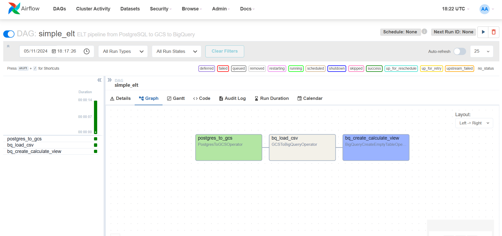
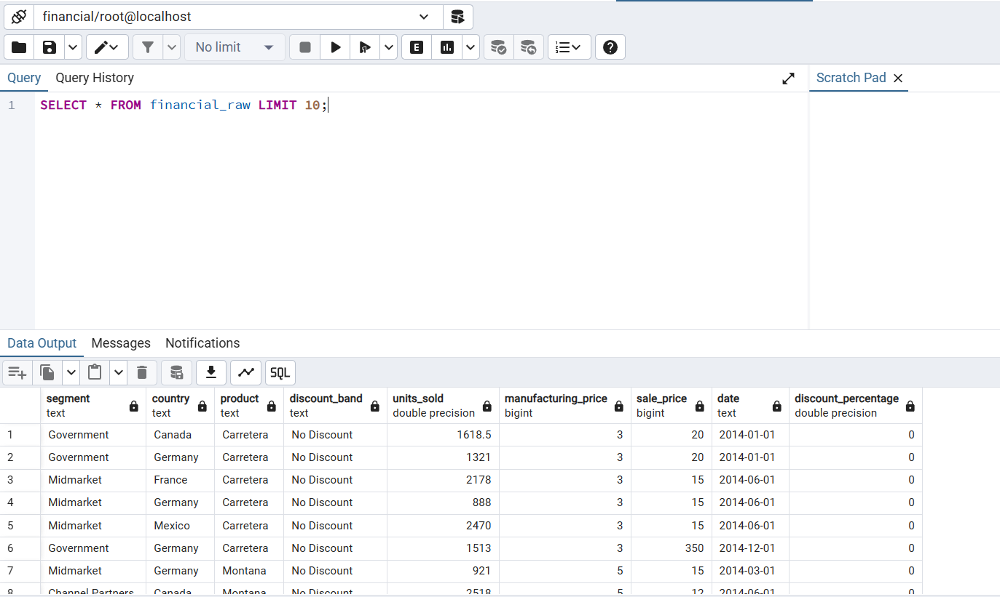
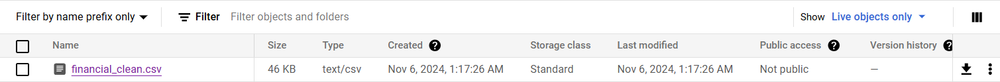
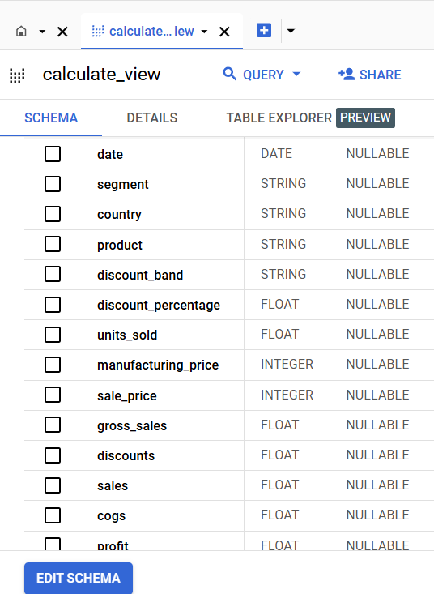

# Simple ELT

A lightweight ELT (Extract, Load, Transform) pipeline built with Python to perform simple data extraction, loading, and transformation tasks. This project is designed to be easy to understand and extend, making it a great starting point for those who want to learn about ELT processes.

## Features
- Extract data from PostgreSQL
- Load data into a staging area
- Transform data using SQL to calculate `Discounts`, `Sales`, `COGS`, and `Profit`

### Airflow

### PostgreSQL

### Google Cloud Storage

### Google BigQuery

